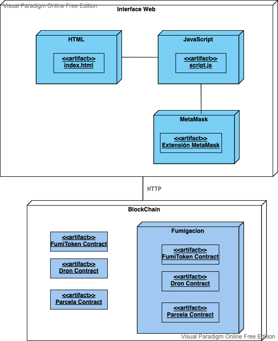
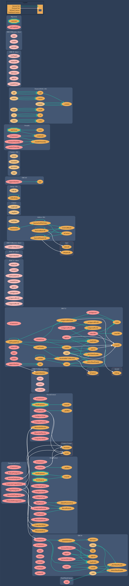

# front_blockchain_tfe

# Trabajo Final de Experto:
## Experto Universitario en Desarrollo de Aplicaciones Blockchain

Una empresa ha desarrollado un sistema de fumigación con drones y nos ha solicitado que desarrollemos una solución basada en la blockchain

Trabajo realizado por:

- DOMÍNGUEZ PÉREZ, IVÁN ENRIQUE
- SANTANA RODRÍGUEZ, JORGE F
- HERNANDEZ OAKNIN, YAEL MAZALTOB

Solución desplegada en la red de test Rinkeby de Ethereum: https://rinkeby.etherscan.io/

Instalación de MetaMask: https://metamask.io/download/

## Enunciado: 

Una empresa ha desarrollado un sistema de fumigación con drones y nos ha solicitado que desarrollemos una solución basada en la blockchain de Alastria para su uso.

Las características propias de los drones son:

- Un identificador único y ascendente, comenzando en 1 y que no puede repetirse.
- La empresa que lo gestiona, que será la única que pueda mandar acciones al dron.
Altura máxima y mínima de vuelo.
- Una lista de pesticidas que puede suministrar. Los pesticidas existentes son cinco y sus nombres son: Pesticida A, Pesticida B, Pesticida C, Pesticida D y Pesticida E.
- Coste.

La operación de fumigación es inmediata y debe lanzar un evento de parcela fumigada con el ID de la parcela.

Las características de las parcelas son:

- Un identificador único y ascendente, que comienza en 1 y que no puede repetirse.
- Un propietario.
- Altura máxima y mínima de vuelo permitida.
- Pesticida aceptado, que va a ser uno de la lista de pesticidas descrita anteriormente.

Otras operaciones que debe suministrar la plataforma son:

- Contratar un dron a la empresa para desinfectar una parcela con un pesticida determinado. Esta operación debe lanzar un evento con el ID del Dron que va a realizar la fumigación y el ID de la parcela que se va a fumigar.
- Pago de la operación realizada desde la cuenta del propietario a la de la empresa.
- Para la gestión de pagos se debe crear un token propio basado en el estándar ERC 20. Además, los drones y las parcelas pueden gestionarse mediante tokens no fungibles basados en el estándar ERC 721.

La empresa solicita tener una interfaz web que le permita registrar los drones y asignarles trabajos. A su vez, también se debe proporcionar una interfaz web para que los propietarios de las parcelas las puedan registrar y tengan la posibilidad de contratar un dron con las características que requiere su parcela y que pueda desplazarse hasta la misma.


# Entregables:
## Memoria con:

Como resultado de las actividades propuestas en el apartado anterior el alumno deberá entregar:
Una memoria en la que se incluya la siguiente información:

- Justificación del uso de la tecnología blockchain para resolver el problema propuesto.
- Análisis y modelo del sistema propuesto.
- Descripción del entorno de desarrollo utilizado:
    - `Remix` 
    - `Visual Studio Code` con las estensiones: 
        - Solidity
        - Solidity Visual Developer
        - Linter `solium` para verificar que lo escribimos no tiene errroes.
        - Para los TEST utilizamos, Truffle y HardHat con su coverage
- Instrucciones de despliegue.
    - clonar el repositorio: https://github.com/creacodigos/front_blockchain_tfe.git
    - Ejecutar el comando `yarn` en la carpeta que se genera.
    - Para desplegar los contratos en local: `yarn truffle migrate`
    - Para desplegar los contratos en Rinkeby: `yarn truffle migrate --network rinkeby`
    - Para correr los TEST: `yarn  hardhat test`
    - Para correr el TEST COVERAGE: `yarn hardhat coverage`
    - Abrir la WEB para probar online: `https://creacodigos.github.io/front_blockchain_tfe/`
- Manual de usuario, incluyendo capturas de pantalla a modo de ejemplo de cada funcionalidad de la solución.
Conclusiones.
- Diagrama de despliegue (artifacts) 


- Diagrama de casos de uso
- Diagrama de clases:


	
- Diagrama de secuencia:

](https://mermaid.live/edit#pako:eNrFU0tOAzEMvUqULeUCs6gEpd2BEL9uZuMmLk3JJCVxilDVI7HiCL0YzkyH6UCFWCCRVRS_Zz8_xxupvEZZyIjPCZ3CCwOPAarSCT6gyAdxHzGUrnnJ99Ph8GSKs0KcKYUaBYgXnDVhfuboJRJUEJ8KMfIOFUEQU7AWqQHl00J66AewRoMyu3cnOG-KCYLxDemTwIy6-AgCYQChmhIaGtyVJxR-jY3sQZf8GkNlyGifGWQc526b-sI5t149jRZgXCEmNi29mJtQcRMUwEVQynDJeMSP8RJVyt3etcDcSfSzgAJtXTcA-eNWTeoaf-lQnVH3yh22Nnbr3ZvPaQ7ldgI67Hei4bw891XwCmOr-oDQSrjBuEoYCToR2a3sWh1MlmqFv5wDtgZ3Q-iNoT8Fa9kPDT8P4Lgje-p_mCEHsuKvCkbzVm4ytJS0wApLWfBV4xwYWMrSbRmaVhoIx9rwospiDjbiQEIif_vqlCwoJGxB-83eo7YfuABZqQ)
	

# Instalación

Ejecutamos la instalación de paquetes con YARN:

`yarn`

Agregamos truffle al proyecto:

`yarn add truffle`

Agregamos openZeppelin los contratos:

`yarn add @openzeppelin/contracts`

Iniciamos truflle (si es la primera ejecución tras su instalación):

`yarn truffle init`

Ejecutamos una prueba de la red en local:

`yarn truffle develop (prueba local)`

Probar con el nodo local requiere instalar `ganache-cli` con:

`yarn add ganache-cli`

Agrego balance a la cuenta definida:

`yarn ganache-cli --account="<PRIVATE_KEY>,<BALANCE>"`

Lanzamos el migrate en la red local (requiere `yarn truffle develop`):

`yarn truffle migrate`

Ejecutamos la compilación el despliegue de contratos en local (simula lo que haría en real): 

`yarn truffle migrate (Compila y despliega contratos)`

Creamos cuenta en infura y cambiamos la configuración de `truffle-config.js`
Para usar el provider con private key de lacuenta de ethereum asociada para el cas de Ethers

`yarn add truffle-privatekey-provider`

Ejecutamos la compilación en rinkeby:

`yarn truffle migrate --network rinkeby` (Compila y despliegua contratos en rinkeby)

Ejecutar Test completos (require tener levantado el nodo el `yarn truffle develop`):

`yarn truffle test`

Ejecutar Test específico:

`yarn truffle test ./test/Dron.js`

Ejecutar cobertura de tests:

`yarn truffle run coverage`

Solidity Visual Developer para auditar visualmente los contratos desde el editor:

`https://marketplace.visualstudio.com/items?itemName=tintinweb.solidity-visual-auditor`

## HardHat

Entorno HardHat, para test y despliegues más estable que Truffle

`yarn add hardhat`

Instalar módulos:

`yarn add @nomiclabs/hardhat-waffle @nomiclabs/hardhat-ethers solidity-coverage ethereum-waffle`

Compilar con HardHat:

`yarn hardhat compile` 

Lanzar test:

`yarn  hardhat test`

`yarn  hardhat test ./testHardhat/Dron.js`

Lanzar Coverage:

`yarn  hardhat coverage`


------
# HERRAMIENTAS UTILIZADAS

## Contratos y utilidades de

- openZeppelin
- ethers (front)
- metamask (front)
- node.js
- Remix
## TESTs

- Remix (e2e)
- Truffle (unitarios)
- Hardhat (unitarios)
- Metamask (Control de redes y wallets correctas y conectadas)
- Truffle Coverage tenía un comportamiento anómalo.
- HardHat Coverage

## Linter para verificar código y por seguridad:

- Solium
- Solhint
- Remix

## Extensiones con ayudas, lintern y verificación de código estático:

- Solidity
- Solidity Visual Developer

## Gráficos y Diagramas con la extensión:

Solidity Visual Developer :
- Surya
- UML
- PlantUML
- Inheritance.
- Parse.

# DIAGRAMAS DE SECUENCIA:

En esta fabulosa web se pueden crear los diagramas con texto:
https://mermaid.live/

Aquí la guía para crearlos: https://mermaid-js.github.io/mermaid/#/sequenceDiagram

Este creo que sería el diagrama de secuencia completo:
https://mermaid.live/view#pako:eNrFU0tOAzEMvUqULeUCs6gEpexAiF83s3ETQ9NmkpI4RQhxJFYcoRfDmTBMByrEAomsMvZ79vPz5Fkqr1FWMuJDQqfwxMB9gKZ2gg8o8kHcRAy1K5F8PxyPD2Y4r8SRUqhRgHjEeUlzmLNnSNBAXFVi4h0qgiBmYC1SAeXTQQboW7BGgzLbNye4booJgvGF9ElgRtt8AoEwgFClhYaCO_eEwm-wyB71xS8wNIaM9plBxnHtbqgvnGPr1WqyAOMqcWrT0os7ExoeggK4CEoZbhn3-DFdokp52usOmCeJfh5QoG37BiC_36rTtsdfOtRW1IN2u6NN3Wb76nOZXbm9gB77nWi4Lu99HbzC2KneIXQSLjGuE0aCXkR2K7vWJpOlVuEv94Cdwf0SBmsYbsFa9kPDzwvY78gH9T_MkCPZ8K8KRvOrfM7QWtICG6xlxVcNYVXL2r0wLq01EE614VcqKwoJRxIS-asnp7rvgvl41SX48g7zZ1fQ

](https://mermaid.live/edit#pako:eNrFU0tOAzEMvUqULeUCs6gEpd2BEL9uZuMmLk3JJCVxilDVI7HiCL0YzkyH6UCFWCCRVRS_Zz8_xxupvEZZyIjPCZ3CCwOPAarSCT6gyAdxHzGUrnnJ99Ph8GSKs0KcKYUaBYgXnDVhfuboJRJUEJ8KMfIOFUEQU7AWqQHl00J66AewRoMyu3cnOG-KCYLxDemTwIy6-AgCYQChmhIaGtyVJxR-jY3sQZf8GkNlyGifGWQc526b-sI5t149jRZgXCEmNi29mJtQcRMUwEVQynDJeMSP8RJVyt3etcDcSfSzgAJtXTcA-eNWTeoaf-lQnVH3yh22Nnbr3ZvPaQ7ldgI67Hei4bw891XwCmOr-oDQSrjBuEoYCToR2a3sWh1MlmqFv5wDtgZ3Q-iNoT8Fa9kPDT8P4Lgje-p_mCEHsuKvCkbzVm4ytJS0wApLWfBV4xwYWMrSbRmaVhoIx9rwospiDjbiQEIif_vqlCwoJGxB-83eo7YfuABZqQ)

```
sequenceDiagram
    actor User

    User->>+Web: Accede a web
    Web->>Metamask: Conectar Wallet
        Metamask->>Metamask: Validación de usuario
    Metamask-->>Web: Cartera conectada
    Note over User,Metamask: Permitido continuar

    Note over User,BlockChain: Flujo firmar transacciones
    User->>+Web: Ejecutar Transacción sobre el contrato
    Web->>Metamask: Firmar
        Metamask->>Metamask: Validación de usuario
    Metamask-->>Web: Firmado
    Web->>BlockChain: Envío de Transacción
        BlockChain->>BlockChain: Enviado a procesar
    BlockChain-->>Web: Respuesta
    Web-->>+User: Resultado

    Note over User,BlockChain: Flujo ejecutar acciones

    User->>Web: Ejecutar llamada sobre el contrato
    Web->>BlockChain: Envío de llamada
        BlockChain->>BlockChain: Enviado a procesar
    BlockChain-->>Web: Respuesta
    Web-->>+User: Resultado
```

Por partes sería:

Conectar cartera con metamask: https://mermaid.live/view#pako:eNpVkEFuAjEMRa8SeVt6gSyQKuiyq6plk43HsdqISVI8jiqEOBVH4GJ4CFOpXvnb78f6OQHVyOBh4kPjQrxN-CWYQ3FW2LSWlgeWhyat4j6mRc_d83r9tOPBuxcijuzQ_fLQ1za27RsrZpz23m1qYVIUt8NxZO3QXAvyj_7EMUWkdL0UZ--2qaGk2k1_BnPcj29QlAUd9RMRYQWZJWOKFu40uwLoN2cO4K2NKPsAoZyNaz8RlV9jsnDgVRqvYE7-fiy06M48PqcPzzf9DGqb
```
sequenceDiagram
    autonumber
    actor User
    User->>+Web: Accede a web
    Web->>Metamask: Conectar Wallet
        Metamask->>Metamask: Validación de usuario
    Metamask-->>Web: Cartera conectada
```

Enviar transacción con firma: https://mermaid.live/view#pako:eNplUTtSAzEMvYrHLeECW6QghI4GAmm20doaYnZtL7LMDJPJkag4Qi6GvB82GVTp897TG-moTbSoK53wI2MweO_gjcDXQUlA5hiyb5Cm2nAk9ZJKPXZKfrte3-yxqdT2HU1mILUjCAmMceefoFJsCBV2ysTABBxHpjCE-IgMHlJbqQdHHqY9JebJFegVOmdh1LWocspAbhL8IwhjsDMo2qt1d1007eYALojb8Hn-jkXm0u5iYMH-JzrRVaB6igbT7PqCMFt4wtRnTAyLiXKtcrVhmDsWJb3SHsWrs_KIY4HWmg_osdaVpBaorXUdToLLvQXGrXXyCF0xZVzp8qXnr2DmesRMjxybp1-OYqXp
```
sequenceDiagram
    autonumber
    actor User

    User->>+Web: Ejecutar Transacción sobre el contrato
    Web->>Metamask: Firmar
        Metamask->>Metamask: Validación de usuario
    Metamask-->>Web: Firmado
    Web->>BlockChain: Envío de Transacción
        BlockChain->>BlockChain: Enviado a procesar
    BlockChain-->>Web: Respuesta
    Web-->>+User: Resultado
```
Enviar llamada sin firma: https://mermaid.live/view#pako:eNplkE1OAzEMha9iZUu5wCy6AHoBEGKTjSexaGgSD46DhKoeiVNwMRIyoyLhlX_elzy9s3HsyUym0Hul7Ogh4KtgshlaYVXONc0k6-yUBZ5Ln8em97f7_QvNExzeyFVFgRgxoUcoPAsBRXCcVVB5ME3ckLvI7nR_xJAbmT--vxg8begQ9rrK_jMBPQPCIuyo4OrxD7AZe6SyVCqK1__b6aZ7_z3WqO0lszOJJGHwLY5zl1qjR0pkzdRaj3KyxuZL09XFo9LBhxaHmVQq7UzP6ukzu20emjXOsbz8AEhHe40
```sequenceDiagram
    autonumber
    actor User

    User->>Web: Ejecutar llamada sobre el contrato
    Web->>BlockChain: Envío de llamada
        BlockChain->>BlockChain: Enviado a procesar
    BlockChain-->>Web: Respuesta
    Web-->>+User: Resultado
```
